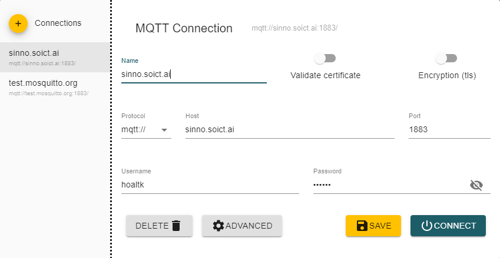
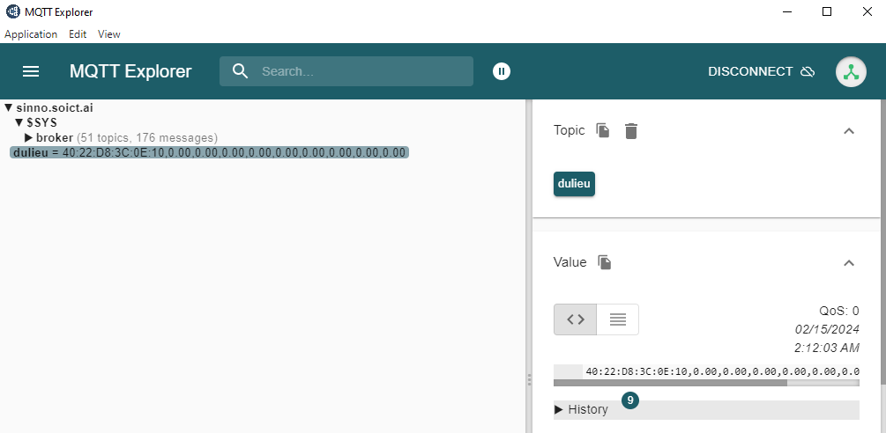
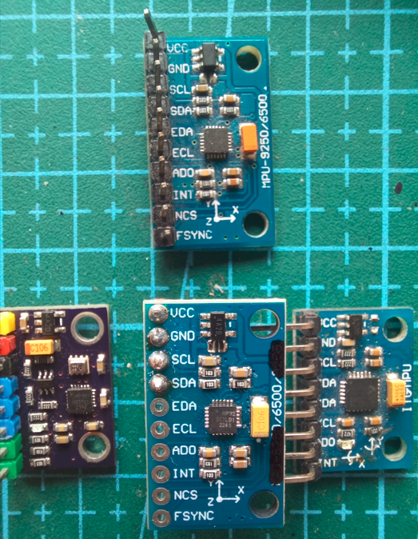

A. Xây dựng thiết bị thu thập triệu chứng vận động ở bệnh nhân
Cảm biến GY-9250 9DOF IMU MPU9250: Sử dụng cảm biến này để thu thập dữ liệu về góc phương vị đông tây nam bắc, vận tốc góc và gia tốc góc của bệnh nhân.
ESP32 Lite V1.0.0 Wifi Bluetooth: Sử dụng module ESP32 Lite để kết nối với mạng Wifi và Bluetooth.
Kết nối thiết bị: Kết nối ESP32 với cảm biến GY-9250 và nguồn điện pin.
Nâng cao: Định vị - Cải thiện thiết bị bằng cách tích hợp khả năng định vị GPS.
Nâng cao: Màn hình - Thêm màn hình 7-segment hoặc OLED để hiển thị trình tự đợi hoặc mã số thiết bị.
Nâng cao: Lưu trữ tạm dữ liệu - Có khả năng lưu trữ tạm dữ liệu trong vùng nhớ flash khi mất kết nối mạng.
B. Tính năng/firmware của thiết bị
Thu thập dữ liệu: Thiết bị thu thập dữ liệu về góc phương vị đông tây nam bắc, vận tốc góc và gia tốc góc từ cảm biến GY-9250.
Lưu trữ mã định danh trên thiết bị IoT: Thiết bị có khả năng lưu trữ mã định danh trên bộ nhớ flash sử dụng thư viện Preferences.
Sử dụng thuật toán Kalman: Áp dụng thuật toán Kalman để cải thiện chính xác và ổn định của dữ liệu thu thập được.
Nâng cao: Tự triển khai MQTT riêng cá nhân - Có khả năng triển khai giao thức MQTT riêng cho việc truyền dữ liệu lên máy chủ.
C. Server
Sử dụng MQTT có sẵn, public: Sử dụng giao thức MQTT công khai và sẵn có để truyền dữ liệu từ thiết bị lên máy chủ.
Nâng cao: Viết trang web để lấy thông tin từ MQTT và hiển thị theo cách riêng: Tạo một trang web riêng để lấy dữ liệu từ MQTT và hiển thị theo cách tùy chỉnh.
D. Thiết kế cấu trúc dữ liệu cho truyền thông giữa thiết bị và máy chủ
Sử dụng JSON: Sử dụng định dạng JSON để đóng gói dữ liệu thu thập từ thiết bị trước khi gửi đến máy chủ.
Bảo mật: Áp dụng bảo mật bằng cách sử dụng một phương pháp băm đơn giản để tránh tiêu thụ điện và bảo vệ dữ liệu.
Nâng cao: Cấu trúc dữ liệu lưu trữ trên bộ nhớ flash: Thiết kế một cấu trúc dữ liệu phù hợp khi lưu trữ thông tin trên bộ nhớ flash của thiết bị.
Tổng quan quy trình
Thiết bị thu thập dữ liệu: Mỗi thiết bị được gắn vào một bệnh nhân riêng biệt và thu thập dữ liệu y tế hoặc các thông số khác. Trong quá trình thiết lập ban đầu, thiết bị sẽ cần có một mã định danh duy nhất cho từng bệnh nhân.

Lưu trữ mã định danh trên thiết bị: Sử dụng thư viện Preferences, bạn có thể lưu trữ mã định danh bệnh nhân trên bộ nhớ flash của thiết bị. Thư viện Preferences cho phép bạn lưu trữ dữ liệu theo cặp khóa-giá trị. Bạn có thể sử dụng mã định danh bệnh nhân làm khóa và lưu trữ nó trong bộ nhớ flash. Điều này cho phép thiết bị duy trì mã định danh ngay cả khi nó bị tắt nguồn hoặc khởi động lại.

Gửi dữ liệu lên MQTT: Thiết bị sử dụng client MQTT để kết nối và gửi dữ liệu lên broker MQTT, giống như trong quy trình trước đó. Khi gửi dữ liệu lên, thiết bị cần đính kèm mã định danh bệnh nhân vào dữ liệu hoặc topic MQTT, như đã mô tả trước đó.

Web server: Web server của bạn vẫn được triển khai để xử lý và phân tích dữ liệu từ MQTT

Kết nối với MQTT Broker: Web server kết nối với broker MQTT để nhận dữ liệu từ các topic đã đăng ký.

Đăng ký và nhận dữ liệu: Trên web server, bạn đăng ký các subscriber để nhận dữ liệu từ các topic MQTT, tương tự như trước đây. Khi web server nhận được dữ liệu, nó cũng sẽ nhận được mã định danh bệnh nhân từ dữ liệu hoặc topic MQTT.

Xử lý và phân tích dữ liệu: Web server xử lý và phân tích dữ liệu nhận được từ MQTT, bao gồm cả mã định danh bệnh nhân. Bằng cách sử dụng mã định danh bệnh nhân, bạn có thể xác định dữ liệu thuộc về bệnh nhân nào và thực hiện các phân tích hoặc các thao tác khác liên quan đến bệnh nhân đó.

Hiển thị dữ liệu: Kết quả phân tích và thông tin từ dữ liệu MQTT, cùng với mã định danh bệnh nhân, có thể được hiển thị trên giao diện web. Bạn có thể xác định bệnh nhân dựa trên mã định danh và hiển thị thông tin tương ứng với từng bệnh nhân trên giao diện web.

## MQTT Broker

MQTT Broker được cài đặt bằng docker hub tại URL <https://hub.docker.com/_/eclipse-mosquitto> với thông số cấu hình Docker Compose là

```docker
  mqtt:
    image: "eclipse-mosquitto"
    restart: always
    volumes:
      - "/home/mosquitto_dummy/config:/mosquitto/config"
      - "/home/mosquitto_dummy/data:/mosquitto/data"
    ports:
      - "1883:1883"
    networks:
      official:
        ipv4_address: 192.168.51.7    
```

Ngoài ra, cần cấu hình thêm MQTT Broker ở file **/mosquitto/config/mosquitto.conf** để cho phép:

- Cho phép đón nhận kết nối MQTT Client từ internet

```text
listener 1883 0.0.0.0
```

- Cho phép truy cập với các account nằm trong file danh sách

```text
per_listener_settings true
password_file /mosquitto/config/password.txt
```

**Kiểm tra MQTT Broker bằng công cụ MQTT-Explorer**

Kết nối với MQTT Broker \


Xác nhân dữ liệu truyền về từ IoT \


## Cảm biến gia tốc

>Lưu ý: người bán hàng thường không phân biệt được giữa cảm biến 9dof GY-9250 và 6dof GY6500, vì chúng có cùng dạng board. Khó để mua chính xác.

- Với loại MPU-9250 `9 trục`, gợi ý sử dụng thư viện <https://github.com/hideakitai/MPU9250>
- Với loại MPU-6500 `6 trục`, gợi ý sử dụng thư viện <https://github.com/Tockn/MPU6050_tockn>

Dưới đây là ảnh chụp thực tế để so sánh 4 loại cảm biến. Chỉ duy nhất 1 cảm biến ở trên là MPU9250, 3 cảm biến bên dưới đều là 6500.


### Phân biệt MPU6000, MPU6050, MPU6500

|MPU6050 |MPU6000 | MPU6500|
|--|--|--|
| cùng thông số đo | |
|8k mẫu|8k mẫu|32k mẫu|
|I2C|I2C,SPI|I2C,SPI|
- Cùng giá trị, cùng phần cứng đo thông số với 8k mẫu.

### Phân biệt MP9150 và MPU9250

|MPU9150 | MPU9250|
|--|--|
|MPU6050 | MPU6500 |
|AK8975 magnetometer | AK8963 magnetometer |